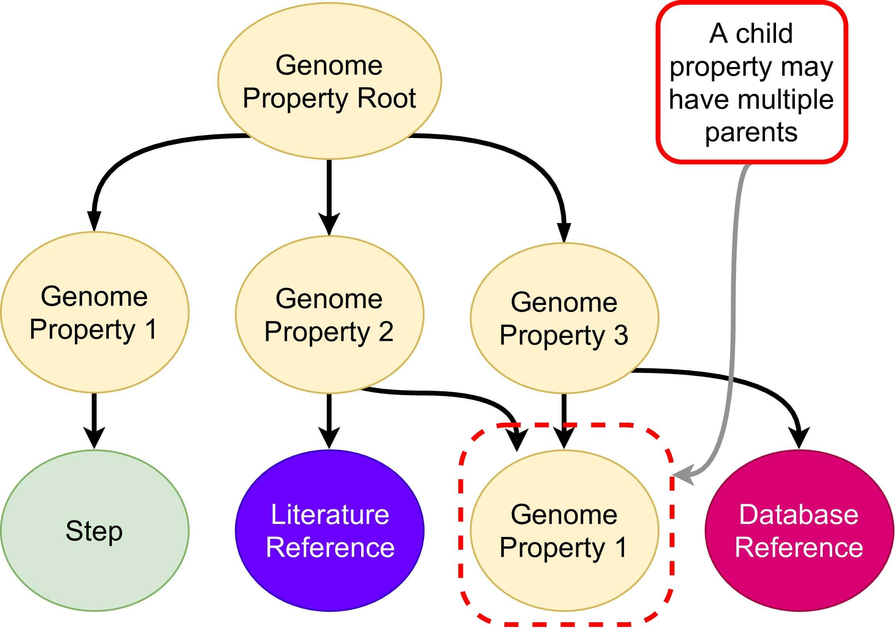
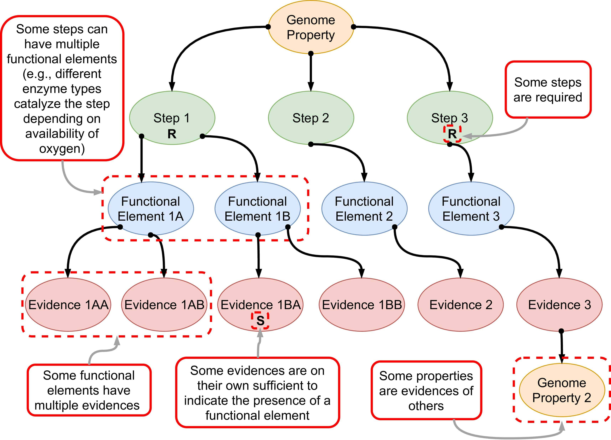

.. Pygenprop documentation master file, created by
   sphinx-quickstart on Sun Mar 17 15:45:23 2019.
   You can adapt this file completely to your liking, but it should at least
   contain the root `toctree` directive.

Pygenprop's Documentation
=========================

.. toctree::
   :maxdepth: 2
   :caption: Contents:

Content
-------

* :ref:`genindex`
* :ref:`modindex`
* :ref:`search`

Overview
--------

Pygenprop is a python library for programmatic exploration and usage of the `EBI Genome Properties database <https://github.com/ebi-pf-team/genome-properties>`_.

Features
--------

At its core the library contains four core components:

* An object model for representing the Genome Properties database as a rooted direct acyclic graph.
* A parser for Genome Properties database flat files.
* A parser for Genome Properties assignment longform files.
* A parser for InterProScan TSV files.

In-memory Data Structures
^^^^^^^^^^^^^^^^^^^^^^^^^

Pygenprop generates a series of in-memory data structures representing the Genome Properties database. A series of steps
support the existence of each genome property, and pieces of evidence support the existence of each of these steps.
Steps are assigned as YES or NO based on evidence, such as the presence of InterPro matches or support for the existence
of child properties. Some steps can be required whereas others can be optional. If all required steps are assigned YES,
then the genome property is also assigned YES. If only a subset of the required steps are assigned YES, then the
property may be assigned PARTIAL or NO. Because some properties rely on the assignments of others, the Genome Properties
database forms a rooted directed acyclic graph (DAG). We refer to this data structure as a "property tree", although
child properties can have multiple parent properties.

    Some property objects are the children of others. Database reference, literature reference and step objects are children of property objects.

    Each property is supported by step, functional element, and evidence objects.

Tutorial
--------

A basic tutorial can be found on our `Github README <https://github.com/Micromeda/pygenprop/tree/master#usage>`_. More
detailed documentation on each module's API can be found in the :ref:`modindex`.